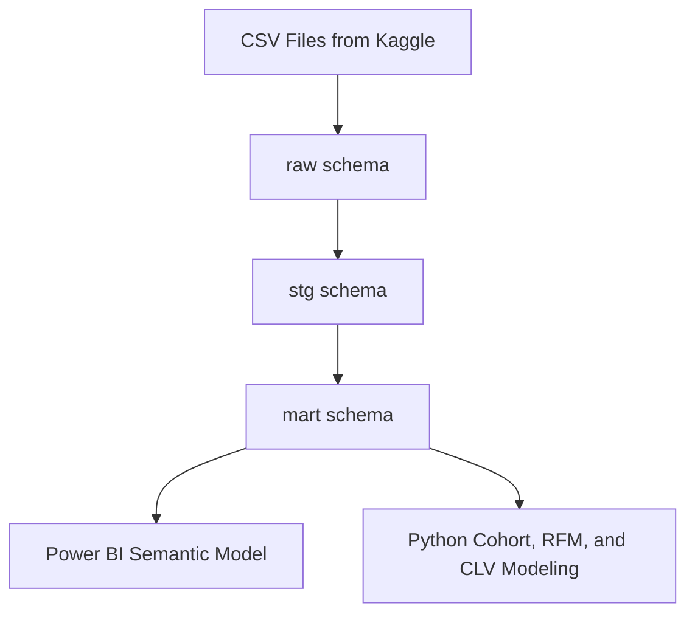

# 🏗️ Phase 3 — SQL Server Database Setup & Raw Table Ingestion Plan
## Olist D2C E-Commerce Cohort Analysis & CLV Engine

<p align="center">
  
  
  
</p>

---

## 1. Purpose of this Phase

Phase 3 prepares the SQL Server environment for the Olist analytics project. The goal is to create a reproducible database setup that can ingest the raw Kaggle CSV files into SQL Server without changing the original source structure.

This phase creates:

| Output | Description |
|---|---|
| SQL Server database | Central database for the project |
| Database schemas | `raw`, `stg`, `mart`, and `audit` schemas |
| Raw landing tables | Source-aligned tables for all 9 Olist CSV files |
| Ingestion scripts | SQL `BULK INSERT` template and Python fallback loader |
| Validation script | Row count, duplicate key, and basic source-to-SQL checks |

---

## 2. Database Layering Strategy

The project will use a layered SQL Server structure:



| Layer | Schema | Purpose |
|---|---|---|
| Raw / Landing | `raw` | Stores source CSV data with minimal transformation |
| Staging | `stg` | Cleans, casts, standardizes, and derives fields |
| Analytics Mart | `mart` | Stores star schema facts, dimensions, cohort tables, RFM, and CLV outputs |
| Audit | `audit` | Stores ingestion logs, row counts, and QA checks |

---

## 3. Why Raw Tables Use Mostly Text Columns

The raw tables are designed as a **landing layer**, so most columns are stored as `NVARCHAR` first. This protects the original data from import failures caused by:

- Blank timestamp values
- Special characters in Portuguese city/category names
- Long review comments
- Embedded commas or quotes in review text
- Numeric fields that may need validation before conversion

Data types will be enforced in the `stg` layer using `TRY_CONVERT`, `TRY_CAST`, and data quality rules.

---

## 4. Raw Files to Ingest

| No. | CSV File | Expected Rows | Target Raw Table |
|---|---:|---:|---|
| 1 | `olist_customers_dataset.csv` | 99,441 | `raw.olist_customers` |
| 2 | `olist_orders_dataset.csv` | 99,441 | `raw.olist_orders` |
| 3 | `olist_order_items_dataset.csv` | 112,650 | `raw.olist_order_items` |
| 4 | `olist_order_payments_dataset.csv` | 103,886 | `raw.olist_order_payments` |
| 5 | `olist_order_reviews_dataset.csv` | 99,224 | `raw.olist_order_reviews` |
| 6 | `olist_products_dataset.csv` | 32,951 | `raw.olist_products` |
| 7 | `product_category_name_translation.csv` | 71 | `raw.product_category_name_translation` |
| 8 | `olist_sellers_dataset.csv` | 3,095 | `raw.olist_sellers` |
| 9 | `olist_geolocation_dataset.csv` | 1,000,163 | `raw.olist_geolocation` |

---

## 5. Required Local Folder Setup

Create this local folder structure on the same machine where SQL Server can access the files:

```text
C:\olist_data\raw\
```

Place all 9 CSV files inside:

```text
C:\olist_data\raw\olist_customers_dataset.csv
C:\olist_data\raw\olist_orders_dataset.csv
C:\olist_data\raw\olist_order_items_dataset.csv
C:\olist_data\raw\olist_order_payments_dataset.csv
C:\olist_data\raw\olist_order_reviews_dataset.csv
C:\olist_data\raw\olist_products_dataset.csv
C:\olist_data\raw\product_category_name_translation.csv
C:\olist_data\raw\olist_sellers_dataset.csv
C:\olist_data\raw\olist_geolocation_dataset.csv
```

> Important: `BULK INSERT` reads from the SQL Server machine, not always from your personal computer. If SQL Server is installed locally, `C:\olist_data\raw\` is fine. If SQL Server is remote, the files must be placed on a path the SQL Server service account can access.

---

## 6. Script Execution Order

Run the scripts in this order:

| Step | Script | Purpose |
|---|---|---|
| 1 | `sql/01_create_database_and_schemas.sql` | Creates database and schemas |
| 2 | `sql/02_create_raw_tables.sql` | Creates raw landing tables |
| 3 | `sql/03_bulk_insert_raw_tables.sql` | Loads CSV files into raw tables |
| 4 | `sql/04_validate_raw_ingestion.sql` | Validates row counts and key checks |

If `BULK INSERT` has issues with review comments or CSV quoting, use:

```text
scripts/03_load_raw_csv_to_sql_server.py
```

The Python loader is often more reliable for CSV files with long text fields.

---

## 7. Recommended GitHub File Placement

```text
olist-clv-cohort-analysis/
├── docs/
│   └── 05_sql_server_setup_ingestion_plan.md
├── sql/
│   ├── 01_create_database_and_schemas.sql
│   ├── 02_create_raw_tables.sql
│   ├── 03_bulk_insert_raw_tables.sql
│   └── 04_validate_raw_ingestion.sql
├── scripts/
│   └── 03_load_raw_csv_to_sql_server.py
└── data/
    └── raw/
        └── .gitkeep
```

Do **not** commit the raw CSV files to GitHub. Keep them local and add this to `.gitignore`:

```gitignore
data/raw/*.csv
*.bak
*.trn
```

---

## 8. Raw Ingestion Validation Requirements

After ingestion, validate:

| Check | Expected Result |
|---|---|
| Raw row counts | Must match the expected row counts listed above |
| Primary key uniqueness | Customers, orders, products, and sellers should be unique |
| Composite key uniqueness | Order items and payments should be unique by composite key |
| Foreign key readiness | Child table IDs should map to parent tables where expected |
| Date fields | Date fields should be convertible in staging |
| Numeric fields | Price, freight, and payment values should be convertible in staging |
| Review score | Review score should convert to integers from 1 to 5 |
| Geolocation | Duplicate zip prefixes are expected and handled later in staging |

---

## 9. Phase 3 Completion Checklist

| Task | Status |
|---|---|
| Database creation script prepared | ✅ Done |
| Raw, staging, mart, and audit schemas planned | ✅ Done |
| Raw landing tables scripted | ✅ Done |
| CSV ingestion script prepared | ✅ Done |
| Python fallback ingestion script prepared | ✅ Done |
| Raw ingestion validation script prepared | ✅ Done |
| Ready for Phase 4: Staging, Cleaning, and Data Quality Checks | ✅ Yes |

---

<p align="center">
  <b>Next Phase:</b> Phase 4 — Staging Layer, Data Cleaning, and Data Quality Checks
</p>
