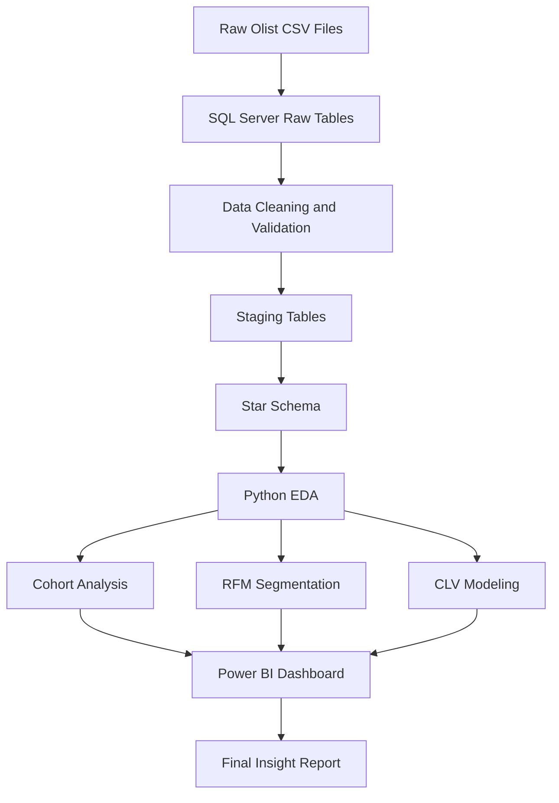

# 📌 Business Requirements Document

## D2C E-Commerce Cohort Analysis & Customer Lifetime Value Engine

  
  
  

---

## 1. Project Overview

**Project Title:** D2C-style E-Commerce Cohort Analysis & Customer Lifetime Value Engine using Olist Marketplace Data

**Business Context:**
Olist is a Brazilian e-commerce marketplace that connects small and medium-sized sellers to online customers. The company needs stronger visibility into customer retention, repeat purchase behavior, product category performance, logistics friction, and long-term customer value.

This project will analyze customer cohorts, retention behavior, RFM segments, historical customer value, and predictive Customer Lifetime Value. The final output will support business decisions for marketing, logistics, customer retention, and seller acquisition strategy.

---

## 2. Business Problem

Olist appears to have a low repeat purchase rate, meaning many customers purchase only once. This creates a business challenge because continuously acquiring new customers can become expensive and inefficient.

The company also faces logistics-related issues, such as freight cost variation and long delivery times across Brazilian regions. These factors may affect customer satisfaction, review scores, repeat purchase behavior, and long-term value.

The main business problem is:

> **Olist needs to identify which customer cohorts, product categories, and geographic segments generate stronger retention and higher customer lifetime value, while understanding how logistics friction affects customer experience and profitability.**

---

## 3. Business Objectives

| Objective No. | Business Objective                                         | Expected Business Value                                                     |
| ------------- | ---------------------------------------------------------- | --------------------------------------------------------------------------- |
| 1             | Analyze customer retention by acquisition cohort           | Identify which customer groups continue purchasing after their first order  |
| 2             | Measure customer value using historical and predictive CLV | Support customer prioritization and marketing allocation                    |
| 3             | Segment customers using RFM analysis                       | Identify champions, loyal customers, at-risk customers, and one-time buyers |
| 4             | Evaluate logistics friction                                | Understand how freight cost and delivery time affect reviews and retention  |
| 5             | Analyze product category performance                       | Find categories with strong revenue, satisfaction, and customer value       |
| 6             | Analyze geographic performance                             | Identify states and regions with stronger customer and logistics outcomes   |
| 7             | Build an executive Power BI dashboard                      | Provide stakeholders with interactive business insights                     |

---

## 4. Stakeholder Requirements

| Stakeholder Group      | Business Needs                                                  | Analytics Requirement                                          |
| ---------------------- | --------------------------------------------------------------- | -------------------------------------------------------------- |
| Executive / Management | Understand long-term business health and customer profitability | Executive KPIs, CLV overview, retention trends                 |
| Marketing Team         | Identify valuable customers and reduce wasted campaign effort   | RFM segmentation, cohort retention, high-value customer groups |
| Business Development   | Prioritize seller acquisition by category and region            | Product category and geography analysis                        |
| Logistics / Operations | Understand delivery and freight issues                          | Delivery time, delay rate, freight-to-order ratio              |
| Technical / Data Ops   | Maintain clean and reproducible analytics workflow              | SQL Server database, Python notebooks, Power BI model          |
| BI / Analytics Team    | Deliver reliable insights and dashboard reporting               | KPI definitions, data model, QA checks, final dashboard        |

---

## 5. Key Business Questions

### Customer Retention

| No. | Business Question                                                               |
| --- | ------------------------------------------------------------------------------- |
| 1   | What percentage of customers make more than one purchase?                       |
| 2   | Which monthly acquisition cohorts show the highest retention?                   |
| 3   | How does retention change over time after the first purchase?                   |
| 4   | Which product categories are associated with stronger repeat purchase behavior? |
| 5   | Which customer states have better retention performance?                        |

### Customer Lifetime Value

| No. | Business Question                                                      |
| --- | ---------------------------------------------------------------------- |
| 1   | Which customers generate the highest historical revenue?               |
| 2   | Which customers are predicted to generate the highest future value?    |
| 3   | Which product categories produce higher customer value?                |
| 4   | Which geographic segments have stronger CLV potential?                 |
| 5   | Which customer segments should be prioritized for retention campaigns? |

### RFM Segmentation

| No. | Business Question                                           |
| --- | ----------------------------------------------------------- |
| 1   | How many customers are one-time buyers?                     |
| 2   | Who are the champion and loyal customer segments?           |
| 3   | Which customers are at risk of becoming inactive?           |
| 4   | Which customers have high monetary value but low frequency? |
| 5   | Which RFM groups should receive targeted marketing actions? |

### Logistics and Customer Experience

| No. | Business Question                                                   |
| --- | ------------------------------------------------------------------- |
| 1   | Which regions experience the longest delivery times?                |
| 2   | Which regions have the highest freight-to-order ratio?              |
| 3   | Do delayed deliveries result in lower review scores?                |
| 4   | Do high freight costs affect repeat purchase behavior?              |
| 5   | Which product categories have logistics-related performance issues? |

### Product and Geography Strategy

| No. | Business Question                                                                   |
| --- | ----------------------------------------------------------------------------------- |
| 1   | Which product categories generate the highest revenue?                              |
| 2   | Which categories have the best combination of revenue, review score, and retention? |
| 3   | Which Brazilian states have strong demand and customer value?                       |
| 4   | Which states show logistics friction that may reduce customer satisfaction?         |
| 5   | Where should Olist prioritize seller acquisition and operational improvement?       |

---

## 6. Project Scope

### In Scope

| Area             | Included                                                                         |
| ---------------- | -------------------------------------------------------------------------------- |
| Data ingestion   | Load Olist CSV files into SQL Server                                             |
| Data cleaning    | Handle missing values, duplicates, invalid dates, and incorrect data types       |
| Data modeling    | Build staging tables and star schema                                             |
| EDA              | Analyze revenue, orders, customers, products, logistics, and reviews             |
| Cohort analysis  | Monthly retention cohorts using customer_unique_id                               |
| RFM segmentation | Segment customers by recency, frequency, and monetary value                      |
| CLV analysis     | Historical CLV and predictive CLV where applicable                               |
| Dashboarding     | Build Power BI dashboard for business users                                      |
| Documentation    | Business requirements, KPI definitions, data dictionary, QA report, final report |

### Out of Scope

| Area                           | Reason                                                          |
| ------------------------------ | --------------------------------------------------------------- |
| Real CAC calculation           | Dataset does not include marketing spend or acquisition channel |
| Real profit margin calculation | Dataset does not include product cost or margin                 |
| Campaign attribution           | Dataset does not include campaign source data                   |
| Real-time reporting            | Dataset is historical and static                                |
| Production deployment          | Project is for portfolio and analytics demonstration purposes   |

---

## 7. Assumptions

| No. | Assumption                                                                                               |
| --- | -------------------------------------------------------------------------------------------------------- |
| 1   | `customer_unique_id` represents the real customer identity and will be used for retention, RFM, and CLV. |
| 2   | Delivered orders will be the primary basis for revenue, retention, and CLV analysis.                     |
| 3   | Freight value represents logistics cost charged at the item/order level.                                 |
| 4   | Review score is used as a proxy for customer satisfaction.                                               |
| 5   | Product category English translation will be used for dashboard readability.                             |
| 6   | CAC will be handled through scenario analysis because actual CAC is not available.                       |

---

## 8. Constraints and Limitations

| Limitation                  | Impact                                                                       |
| --------------------------- | ---------------------------------------------------------------------------- |
| No marketing spend data     | Cannot calculate actual CAC or campaign ROI                                  |
| No profit margin data       | CLV is revenue-based, not profit-based                                       |
| Low repeat purchase rate    | Predictive CLV modeling may be limited for many customers                    |
| Historical dataset only     | Insights may not represent current Olist performance                         |
| Marketplace structure       | Olist is not a pure D2C company, so project is framed as D2C-style analytics |
| Multiple items per order    | Requires careful aggregation to avoid inflated metrics                       |
| Multiple payments per order | Requires separate payment aggregation before joining                         |

---

## 9. Main Deliverables

| Deliverable                    | Description                                                             |
| ------------------------------ | ----------------------------------------------------------------------- |
| Business Requirements Document | Defines objectives, questions, stakeholders, assumptions, and scope     |
| KPI Definition Sheet           | Defines all business and analytical metrics                             |
| Data Inventory                 | Lists datasets, table purpose, and expected joins                       |
| Data Dictionary                | Defines important fields and data types                                 |
| SQL Server Database            | Stores raw, staging, and analytics tables                               |
| Star Schema                    | BI-ready model for reporting                                            |
| EDA Notebook                   | Python analysis of sales, customers, categories, logistics, and reviews |
| Cohort Analysis Notebook       | Monthly customer retention analysis                                     |
| RFM Segmentation Notebook      | Customer segmentation logic and outputs                                 |
| CLV Modeling Notebook          | Historical and predictive customer value analysis                       |
| Power BI Dashboard             | Interactive dashboard for business users                                |
| Final Insight Report           | Executive summary, findings, recommendations, and next steps            |
| GitHub README                  | Portfolio explanation, tools, screenshots, and project structure        |

---

## 10. Success Criteria

| Success Measure       | Target Output                                                       |
| --------------------- | ------------------------------------------------------------------- |
| Data readiness        | Clean, joined, and validated analytical dataset                     |
| KPI clarity           | All key metrics clearly defined and reproducible                    |
| Cohort analysis       | Monthly cohort retention table and heatmap                          |
| Customer segmentation | RFM segments assigned to customers                                  |
| CLV output            | Historical CLV and predictive CLV where valid                       |
| Dashboard usability   | Power BI dashboard answers stakeholder questions                    |
| Business value        | Final recommendations are clear, actionable, and linked to evidence |
| Portfolio readiness   | GitHub repository is organized, documented, and recruiter-friendly  |

---

## 11. Recommended Analysis Flow

---

## 12. Phase 1 Status

| Item                           | Status                           |
| ------------------------------ | -------------------------------- |
| GitHub Repository Created      | ✅ Done                           |
| Business Requirements Document | ✅ Drafted                        |
| KPI Definition Sheet           | ✅ Drafted                        |
| Next Phase                     | Data Inventory + Data Dictionary |

---

  <b>Prepared for:</b> Junior Data/Business Analyst / Business Intelligence Analyst Portfolio Project  

