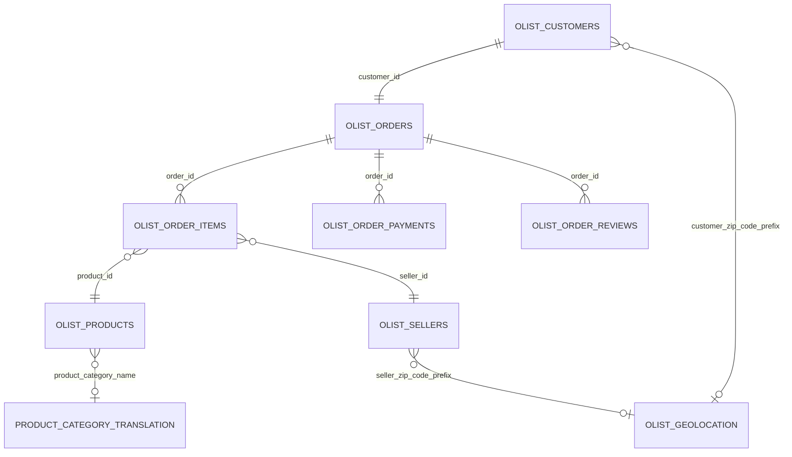

# 🗂️ Data Inventory

## Olist D2C E-Commerce Cohort Analysis & CLV Engine

<p align="center">
  
  
  
</p>

---

## 1. Purpose of this Document

This document inventories all raw datasets used in the **D2C-style E-Commerce Cohort Analysis & Customer Lifetime Value Engine using Olist Marketplace Data** project.

It documents each table’s:

* Business purpose
* Row count and column count
* Data grain
* Primary or natural key
* Foreign key relationships
* Expected use in analytics
* Data quality expectations

This document supports accurate SQL Server ingestion, data modeling, Python analysis, and Power BI reporting.

---

## 2. Source Dataset Overview

The project uses the public **Brazilian E-Commerce Public Dataset by Olist** from Kaggle.

The dataset contains transactional, customer, seller, product, payment, review, and geolocation data for Brazilian e-commerce orders.

---

## 3. Raw Dataset Inventory

| No. |                           Raw File Name |      Rows | Columns | Main Business Area  | Primary Use                                               |
| --- | --------------------------------------: | --------: | ------: | ------------------- | --------------------------------------------------------- |
| 1   |           `olist_customers_dataset.csv` |    99,441 |       5 | Customer            | Customer identity, location, cohort and CLV analysis      |
| 2   |              `olist_orders_dataset.csv` |    99,441 |       8 | Orders              | Order lifecycle, status, purchase and delivery timestamps |
| 3   |         `olist_order_items_dataset.csv` |   112,650 |       7 | Order Items         | Product-level order revenue, freight, seller linkage      |
| 4   |      `olist_order_payments_dataset.csv` |   103,886 |       5 | Payments            | Payment method, installments, payment amount              |
| 5   |       `olist_order_reviews_dataset.csv` |    99,224 |       7 | Reviews             | Review score and customer feedback                        |
| 6   |            `olist_products_dataset.csv` |    32,951 |       9 | Products            | Product category, product attributes, dimensions          |
| 7   | `product_category_name_translation.csv` |        71 |       2 | Product Translation | Portuguese-to-English category mapping                    |
| 8   |             `olist_sellers_dataset.csv` |     3,095 |       4 | Sellers             | Seller identity and seller geography                      |
| 9   |         `olist_geolocation_dataset.csv` | 1,000,163 |       5 | Geolocation         | Zip prefix, latitude, longitude, city, state              |

---

## 4. Table-Level Inventory

## 4.1 `olist_customers_dataset.csv`

| Field                    | Description                                           |
| ------------------------ | ----------------------------------------------------- |
| Business Purpose         | Stores customer identifiers and customer location     |
| Row Count                | 99,441                                                |
| Column Count             | 5                                                     |
| Grain                    | One row per `customer_id`                             |
| Primary / Natural Key    | `customer_id`                                         |
| Important Analytical Key | `customer_unique_id`                                  |
| Main Relationships       | Joins to `olist_orders_dataset` through `customer_id` |
| Used For                 | Customer base, geography, cohort analysis, RFM, CLV   |
| BI Role                  | Customer dimension source                             |

### Important Notes

`customer_id` is unique per order/customer transaction record, but `customer_unique_id` represents the real customer identity across purchases.
For retention, repeat purchase, RFM, and CLV, use `customer_unique_id`.

### Data Quality Expectations

| Check                     | Expected Rule                                                 |
| ------------------------- | ------------------------------------------------------------- |
| `customer_id` uniqueness  | Must be unique                                                |
| `customer_unique_id`      | Can repeat because one real customer can have multiple orders |
| Missing customer location | Should be checked before geographic reporting                 |
| Zip code prefix           | Should be validated before geolocation joins                  |
| State values              | Should match Brazilian state abbreviations                    |

---

## 4.2 `olist_orders_dataset.csv`

| Field                 | Description                                                 |
| --------------------- | ----------------------------------------------------------- |
| Business Purpose      | Stores order status and order lifecycle timestamps          |
| Row Count             | 99,441                                                      |
| Column Count          | 8                                                           |
| Grain                 | One row per `order_id`                                      |
| Primary / Natural Key | `order_id`                                                  |
| Foreign Key           | `customer_id`                                               |
| Main Relationships    | Joins to customers, order items, payments, and reviews      |
| Used For              | Order trends, delivery analysis, retention, cohort analysis |
| BI Role               | Order fact source                                           |

### Order Status Values

| Order Status  | Meaning                                    |
| ------------- | ------------------------------------------ |
| `delivered`   | Order was delivered to customer            |
| `shipped`     | Order was shipped but not marked delivered |
| `canceled`    | Order was canceled                         |
| `unavailable` | Order was unavailable                      |
| `invoiced`    | Order was invoiced                         |
| `processing`  | Order was processing                       |
| `created`     | Order was created                          |
| `approved`    | Order was approved                         |

### Data Quality Expectations

| Check                     | Expected Rule                                                         |
| ------------------------- | --------------------------------------------------------------------- |
| `order_id` uniqueness     | Must be unique                                                        |
| `customer_id` join        | Must exist in customers table                                         |
| Purchase timestamp        | Should not be null                                                    |
| Delivered timestamp       | Required for delivery time analysis                                   |
| Estimated delivery date   | Required for delay analysis                                           |
| Order status              | Should be one of the known status values                              |
| Date sequence             | Purchase date should occur before delivery date                       |
| Delivered-order filtering | Use `order_status = 'delivered'` for CLV, RFM, and retention analysis |

---

## 4.3 `olist_order_items_dataset.csv`

| Field                 | Description                                                      |
| --------------------- | ---------------------------------------------------------------- |
| Business Purpose      | Stores order item-level product, seller, price, and freight data |
| Row Count             | 112,650                                                          |
| Column Count          | 7                                                                |
| Grain                 | One row per order item                                           |
| Primary / Natural Key | Composite key: `order_id` + `order_item_id`                      |
| Foreign Keys          | `order_id`, `product_id`, `seller_id`                            |
| Main Relationships    | Joins to orders, products, and sellers                           |
| Used For              | Revenue, freight, product category performance, seller analysis  |
| BI Role               | Order item fact source                                           |

### Important Notes

An order can contain multiple items.
This table should be aggregated carefully when building order-level metrics to avoid inflated order counts.

### Data Quality Expectations

| Check                    | Expected Rule                                                     |
| ------------------------ | ----------------------------------------------------------------- |
| Composite key uniqueness | `order_id` + `order_item_id` should be unique                     |
| `order_id` join          | Must exist in orders table                                        |
| `product_id` join        | Must exist in products table                                      |
| `seller_id` join         | Must exist in sellers table                                       |
| Price values             | Should be positive                                                |
| Freight values           | Should be zero or positive                                        |
| Revenue aggregation      | Aggregate item-level revenue before joining to payment-level data |

---

## 4.4 `olist_order_payments_dataset.csv`

| Field                 | Description                                                               |
| --------------------- | ------------------------------------------------------------------------- |
| Business Purpose      | Stores payment transactions per order                                     |
| Row Count             | 103,886                                                                   |
| Column Count          | 5                                                                         |
| Grain                 | One row per payment sequence per order                                    |
| Primary / Natural Key | Composite key: `order_id` + `payment_sequential`                          |
| Foreign Key           | `order_id`                                                                |
| Main Relationships    | Joins to orders                                                           |
| Used For              | Payment type analysis, installment behavior, payment value reconciliation |
| BI Role               | Payment fact source                                                       |

### Important Notes

Some orders have multiple payment rows.
Payment data should be aggregated to the order level before joining to order item revenue to avoid duplicate revenue or payment inflation.

### Data Quality Expectations

| Check                    | Expected Rule                                                          |
| ------------------------ | ---------------------------------------------------------------------- |
| Composite key uniqueness | `order_id` + `payment_sequential` should be unique                     |
| `order_id` join          | Must exist in orders table                                             |
| Payment type             | Should be a known payment category                                     |
| Payment value            | Should be non-negative                                                 |
| Installments             | Should be validated because some records may contain zero installments |
| Payment aggregation      | Aggregate by `order_id` before combining with order item totals        |

---

## 4.5 `olist_order_reviews_dataset.csv`

| Field                 | Description                                                             |
| --------------------- | ----------------------------------------------------------------------- |
| Business Purpose      | Stores customer review scores and optional review comments              |
| Row Count             | 99,224                                                                  |
| Column Count          | 7                                                                       |
| Grain                 | One row per review record                                               |
| Primary / Natural Key | `review_id`, although duplicates may exist                              |
| Foreign Key           | `order_id`                                                              |
| Main Relationships    | Joins to orders                                                         |
| Used For              | Customer satisfaction, review score analysis, logistics impact analysis |
| BI Role               | Review fact source                                                      |

### Important Notes

Some orders may have more than one review record.
For order-level customer satisfaction, reviews may need to be aggregated by `order_id`.

### Data Quality Expectations

| Check                    | Expected Rule                                                               |
| ------------------------ | --------------------------------------------------------------------------- |
| `order_id` join          | Must exist in orders table                                                  |
| Review score             | Must be between 1 and 5                                                     |
| Review text              | Optional; high missingness is acceptable                                    |
| Duplicate reviews        | Review duplicate logic should be checked                                    |
| Order-level review score | Aggregate or select latest review when multiple reviews exist for one order |

---

## 4.6 `olist_products_dataset.csv`

| Field                 | Description                                                            |
| --------------------- | ---------------------------------------------------------------------- |
| Business Purpose      | Stores product category and product physical attributes                |
| Row Count             | 32,951                                                                 |
| Column Count          | 9                                                                      |
| Grain                 | One row per `product_id`                                               |
| Primary / Natural Key | `product_id`                                                           |
| Foreign Key           | `product_category_name` to translation table                           |
| Main Relationships    | Joins to order items and category translation                          |
| Used For              | Product category analysis, freight analysis, product-level performance |
| BI Role               | Product dimension source                                               |

### Important Notes

The raw dataset uses the misspelled column names `product_name_lenght` and `product_description_lenght`.
Keep raw names in the raw layer, but rename them in the staging layer to `product_name_length` and `product_description_length`.

### Data Quality Expectations

| Check                   | Expected Rule                                                |
| ----------------------- | ------------------------------------------------------------ |
| `product_id` uniqueness | Must be unique                                               |
| Category missingness    | Should be flagged as `unknown` for reporting                 |
| Product dimensions      | Should be positive where available                           |
| Product weight          | Should be positive where available                           |
| Category translation    | Some categories may not map to English and should be handled |

---

## 4.7 `product_category_name_translation.csv`

| Field                 | Description                                               |
| --------------------- | --------------------------------------------------------- |
| Business Purpose      | Translates Portuguese product category names into English |
| Row Count             | 71                                                        |
| Column Count          | 2                                                         |
| Grain                 | One row per Portuguese product category                   |
| Primary / Natural Key | `product_category_name`                                   |
| Main Relationships    | Joins to products                                         |
| Used For              | Dashboard readability and business reporting              |
| BI Role               | Product category lookup table                             |

### Important Notes

Not all product categories in `olist_products_dataset.csv` have an English translation in this file.
Unmapped categories should be handled in staging using fallback logic.

### Data Quality Expectations

| Check                              | Expected Rule                                         |
| ---------------------------------- | ----------------------------------------------------- |
| `product_category_name` uniqueness | Must be unique                                        |
| English category names             | Should not be null                                    |
| Unmapped product categories        | Should be flagged and assigned fallback English label |

---

## 4.8 `olist_sellers_dataset.csv`

| Field                 | Description                                                                   |
| --------------------- | ----------------------------------------------------------------------------- |
| Business Purpose      | Stores seller identity and seller location                                    |
| Row Count             | 3,095                                                                         |
| Column Count          | 4                                                                             |
| Grain                 | One row per `seller_id`                                                       |
| Primary / Natural Key | `seller_id`                                                                   |
| Main Relationships    | Joins to order items through `seller_id`                                      |
| Used For              | Seller geography, product supply, logistics and business development analysis |
| BI Role               | Seller dimension source                                                       |

### Data Quality Expectations

| Check                  | Expected Rule                              |
| ---------------------- | ------------------------------------------ |
| `seller_id` uniqueness | Must be unique                             |
| Seller zip prefix      | Should be checked before geolocation join  |
| Seller city/state      | Should not be null                         |
| Seller state           | Should match Brazilian state abbreviations |

---

## 4.9 `olist_geolocation_dataset.csv`

| Field                 | Description                                                |
| --------------------- | ---------------------------------------------------------- |
| Business Purpose      | Stores latitude and longitude by Brazilian zip code prefix |
| Row Count             | 1,000,163                                                  |
| Column Count          | 5                                                          |
| Grain                 | Multiple rows per zip code prefix                          |
| Primary / Natural Key | No single unique key in raw form                           |
| Main Join Key         | `geolocation_zip_code_prefix`                              |
| Main Relationships    | Can join to customer and seller zip code prefixes          |
| Used For              | Geographic mapping, customer/seller location analysis      |
| BI Role               | Geography lookup source                                    |

### Important Notes

The geolocation table contains many duplicate zip code prefixes and multiple latitude/longitude points per prefix.
Before joining to customers or sellers, create an aggregated geography lookup table with one row per zip code prefix.

Recommended staging logic:

```sql
SELECT
    geolocation_zip_code_prefix,
    AVG(geolocation_lat) AS avg_latitude,
    AVG(geolocation_lng) AS avg_longitude,
    MIN(geolocation_city) AS city,
    MIN(geolocation_state) AS state
FROM raw.olist_geolocation
GROUP BY geolocation_zip_code_prefix;
```

### Data Quality Expectations

| Check                    | Expected Rule                                                      |
| ------------------------ | ------------------------------------------------------------------ |
| Zip prefix duplicates    | Expected in raw table                                              |
| Aggregation              | Required before joining to customer/seller tables                  |
| Latitude and longitude   | Should be non-null                                                 |
| City/state consistency   | Should be checked for duplicate zip prefixes                       |
| Customer/seller matching | Some customer and seller zip prefixes may not exist in geolocation |

---

## 5. Relationship Map



---

## 6. Relationship Details

| Parent Table                | Child Table                         | Join Key                | Relationship Type           | Notes                                               |
| --------------------------- | ----------------------------------- | ----------------------- | --------------------------- | --------------------------------------------------- |
| `olist_customers_dataset`   | `olist_orders_dataset`              | `customer_id`           | 1 to 1 in raw order dataset | Each order has one customer record                  |
| `olist_orders_dataset`      | `olist_order_items_dataset`         | `order_id`              | 1 to many                   | One order can contain multiple items                |
| `olist_orders_dataset`      | `olist_order_payments_dataset`      | `order_id`              | 1 to many                   | One order can have multiple payment rows            |
| `olist_orders_dataset`      | `olist_order_reviews_dataset`       | `order_id`              | 1 to many                   | Most orders have one review, but some have multiple |
| `olist_order_items_dataset` | `olist_products_dataset`            | `product_id`            | Many to 1                   | Many order items can reference one product          |
| `olist_order_items_dataset` | `olist_sellers_dataset`             | `seller_id`             | Many to 1                   | Many order items can reference one seller           |
| `olist_products_dataset`    | `product_category_name_translation` | `product_category_name` | Many to 1                   | Some product categories are unmapped                |
| `olist_customers_dataset`   | `olist_geolocation_dataset`         | Zip code prefix         | Many to many in raw form    | Aggregate geolocation before joining                |
| `olist_sellers_dataset`     | `olist_geolocation_dataset`         | Zip code prefix         | Many to many in raw form    | Aggregate geolocation before joining                |

---

## 7. Recommended Analytical Grains

| Analytical Table      | Grain                                               | Purpose                           |
| --------------------- | --------------------------------------------------- | --------------------------------- |
| Raw customers         | One row per `customer_id`                           | Source customer table             |
| Customer dimension    | One row per `customer_unique_id`                    | Customer-level analytics          |
| Raw orders            | One row per `order_id`                              | Source order table                |
| Order fact            | One row per `order_id`                              | Order-level KPI reporting         |
| Order item fact       | One row per `order_id` + `order_item_id`            | Item revenue and product analysis |
| Payment fact          | One row per `order_id` + `payment_sequential`       | Payment behavior analysis         |
| Review fact           | One row per review record                           | Review analysis                   |
| Product dimension     | One row per `product_id`                            | Product reporting                 |
| Seller dimension      | One row per `seller_id`                             | Seller reporting                  |
| Geography dimension   | One row per zip code prefix                         | Mapping and location analysis     |
| Customer monthly fact | One row per `customer_unique_id` per purchase month | Cohort and retention analysis     |
| Customer RFM table    | One row per `customer_unique_id`                    | Segmentation                      |
| Customer CLV table    | One row per `customer_unique_id`                    | Historical and predictive CLV     |

---

## 8. Data Quality Summary from Initial Inspection

| Area                 | Observation                                                    | Action Required                                        |
| -------------------- | -------------------------------------------------------------- | ------------------------------------------------------ |
| Customer identity    | `customer_id` is unique, while `customer_unique_id` can repeat | Use `customer_unique_id` for customer-level analysis   |
| Orders               | Some orders are not delivered                                  | Filter to delivered orders for retention, RFM, and CLV |
| Order items          | Some orders contain multiple items                             | Use correct grain to avoid inflated order counts       |
| Payments             | Some orders contain multiple payment rows                      | Aggregate payments before joining to item-level data   |
| Reviews              | Some orders have multiple reviews                              | Aggregate reviews at order level when needed           |
| Products             | Some product categories and attributes are missing             | Use `unknown` fallback values in staging               |
| Category translation | Some product categories are not translated                     | Apply fallback from Portuguese category name           |
| Geolocation          | Duplicate zip code prefixes exist                              | Aggregate to one row per zip prefix before joining     |
| Delivery dates       | Delivered date can be missing for non-delivered orders         | Use delivered orders for delivery performance analysis |
| Date sequence        | Some carrier dates may appear before approval dates            | Flag as operational timestamp anomalies                |

---

## 9. Key Business Rules for Phase 3

| Rule No. | Business Rule                                                                         |
| -------- | ------------------------------------------------------------------------------------- |
| 1        | Use `customer_unique_id` for retention, cohort, RFM, and CLV.                         |
| 2        | Use `customer_id` only to join customers to orders.                                   |
| 3        | Use delivered orders for retention, RFM, CLV, and delivery KPIs.                      |
| 4        | Use item `price` for product revenue.                                                 |
| 5        | Keep `freight_value` separate from product revenue.                                   |
| 6        | Aggregate payments by `order_id` before joining to order-level tables.                |
| 7        | Aggregate reviews by `order_id` before using review scores in order-level analysis.   |
| 8        | Aggregate geolocation by zip code prefix before joining to customer or seller tables. |
| 9        | Use English product category names where available.                                   |
| 10       | Assign fallback values for missing or unmapped categories.                            |

---

## 10. Phase 2 Status

| Item                                 | Status |
| ------------------------------------ | ------ |
| Raw dataset inventory completed      | ✅ Done |
| Table grains documented              | ✅ Done |
| Primary and foreign keys documented  | ✅ Done |
| Relationship map documented          | ✅ Done |
| Data quality expectations documented | ✅ Done |
| Ready for Data Dictionary            | ✅ Yes  |

---
